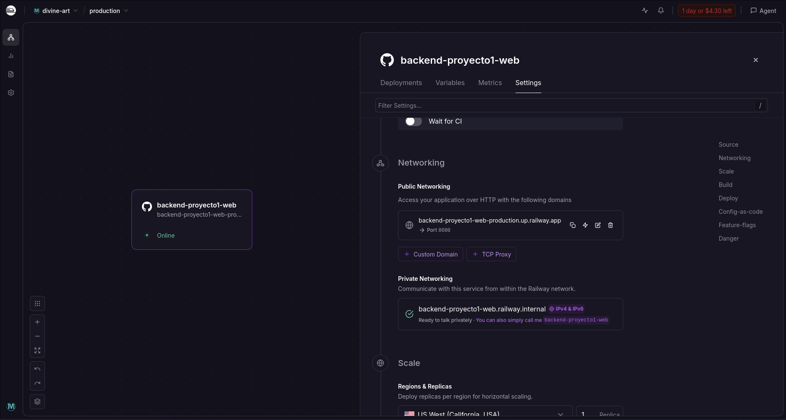

# Series Tracker — Backend 🎬

Backend REST API hecho en Go desde cero (sin frameworks) con SQLite como base de datos.

## Screenshot

### Servidor corriendo


## 🔗 Links
- [Aplicación en producción](https://frontend-proyecto1-web.vercel.app/)
- [Repositorio Frontend](https://github.com/MarceloDetlefsen/frontend-proyecto1-web)

## Cómo correr el proyecto localmente

### Requisitos
- Go 1.22+

### Instalación
```bash
git clone https://github.com/MarceloDetlefsen/backend-proyecto1-web.git
cd backend-proyecto1-web
go run main.go
```

El servidor corre en `http://localhost:8080`. La base de datos `series.db` se crea automáticamente al iniciar.

### Estructura del proyecto
```
.
├── main.go              # Servidor HTTP, CORS y registro de rutas
├── db/
│   └── db.go            # Conexión a SQLite y creación de tablas
├── models/
│   ├── series.go        # Struct Serie
│   └── ratings.go       # Structs Rating y RatingSummary
├── repository/
│   ├── series.go        # Queries de series a la DB
│   └── ratings.go       # Queries de ratings a la DB
├── handlers/
│   ├── series.go        # Handlers HTTP de series
│   └── ratings.go       # Handlers HTTP de ratings
├── series.db            # Base de datos SQLite (se crea automáticamente)
└── README.md
```

## Endpoints

### Series
| Método | Ruta | Descripción |
|--------|------|-------------|
| GET | `/series` | Listar todas las series |
| GET | `/series/{id}` | Obtener una serie por ID |
| POST | `/series` | Crear una serie nueva |
| PUT | `/series/{id}` | Editar una serie existente |
| DELETE | `/series/{id}` | Eliminar una serie |
| PATCH | `/series/{id}/episodio/incrementar` | Sumar +1 al episodio actual |
| PATCH | `/series/{id}/episodio/decrementar` | Restar -1 al episodio actual |

### Ratings
| Método | Ruta | Descripción |
|--------|------|-------------|
| POST | `/series/{id}/ratings` | Agregar un rating (puntuación 1–10) |
| GET | `/series/{id}/ratings` | Obtener ratings y promedio de una serie |
| DELETE | `/ratings/{id}` | Eliminar un rating por ID |

### Query params disponibles en GET /series
| Parámetro | Ejemplo | Descripción |
|-----------|---------|-------------|
| `q` | `?q=breaking` | Buscar por nombre |
| `sort` | `?sort=calificacion` | Ordenar por columna |
| `order` | `?order=desc` | Dirección del orden (`asc` o `desc`) |
| `page` | `?page=2` | Página actual (default: 1) |
| `limit` | `?limit=5` | Resultados por página (default: 10) |

## Challenges implementados

| Challenge | Puntos |
|-----------|--------|
| Códigos HTTP correctos (201, 204, 404, 400) | 20 |
| Validación server-side con errores en JSON | 20 |
| Paginación con `?page=` y `?limit=` | 30 |
| Búsqueda por nombre con `?q=` | 15 |
| Ordenamiento con `?sort=` y `?order=` | 15 |
| Sistema de ratings con tabla propia en DB | 30 |

**Total: 130 puntos**

## Sobre CORS

CORS (Cross-Origin Resource Sharing) es una política de seguridad del navegador que bloquea peticiones HTTP entre orígenes distintos (diferente dominio o puerto). Se configuró un middleware que permite todos los orígenes con los métodos GET, POST, PUT, DELETE, PATCH y OPTIONS.

```
Access-Control-Allow-Origin: *
Access-Control-Allow-Methods: GET, POST, PUT, DELETE, PATCH, OPTIONS
Access-Control-Allow-Headers: Content-Type
```

## Detalles técnicos

- El servidor usa únicamente `net/http` de la librería estándar de Go, sin frameworks externos
- La base de datos es SQLite usando `modernc.org/sqlite`, un driver pure Go que no requiere CGo ni GCC
- La tabla `ratings` tiene una foreign key hacia `series` con `ON DELETE CASCADE`, eliminando automáticamente los ratings al borrar una serie
- La función `GetAllSeries` construye la query dinámicamente con protección contra SQL injection usando `?` como placeholders
- Los endpoints de incrementar/decrementar usan `MIN` y `MAX` directamente en SQL para mantener el episodio dentro del rango válido

## Reflexión

Go resultó una excelente elección para este proyecto. La librería estándar cubre todo lo necesario para un servidor HTTP sin frameworks, lo que obliga a entender realmente cómo funciona el protocolo. El tipado estático y la compilación rápida hacen que los errores aparezcan antes de correr el código, no en runtime.

`modernc.org/sqlite` fue una sorpresa positiva — al ser pure Go elimina la fricción de configurar CGo o GCC, algo que en proyectos anteriores causaba problemas en Windows. Lo usaría de nuevo sin dudarlo.

El punto más interesante fue diseñar los contratos de la API antes de escribir el cliente. Tener endpoints claros con códigos HTTP correctos hace que el frontend sea mucho más predecible de escribir — sabés exactamente qué esperar en cada caso.

## 👨‍💻 Autor
Marcelo Detlefsen - 24554